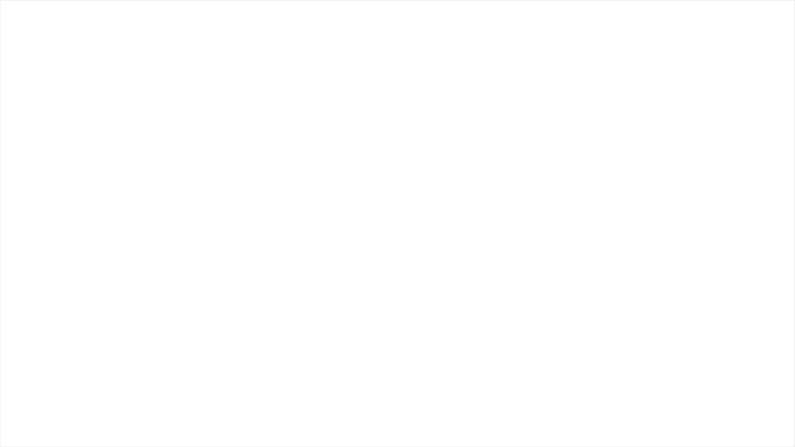

<div align="center">
  
</div>
<h1 align="center">
Simple Quicks
</h1>


##

## Built With

- [React.js]
- [Tailwindcss]


## Installation

1. Clone the repo
   ```sh
   git clone https://github.com/rdhss/simpel-quicks
   ```
2. Install NPM packages
   ```sh
   npm install
   ```
3. Start the Application
   ```sh
   npm start
   ```

## Demonstration

Demo : https://serene-florentine-558340.netlify.app/


## FEATURES

. Task

- Message

